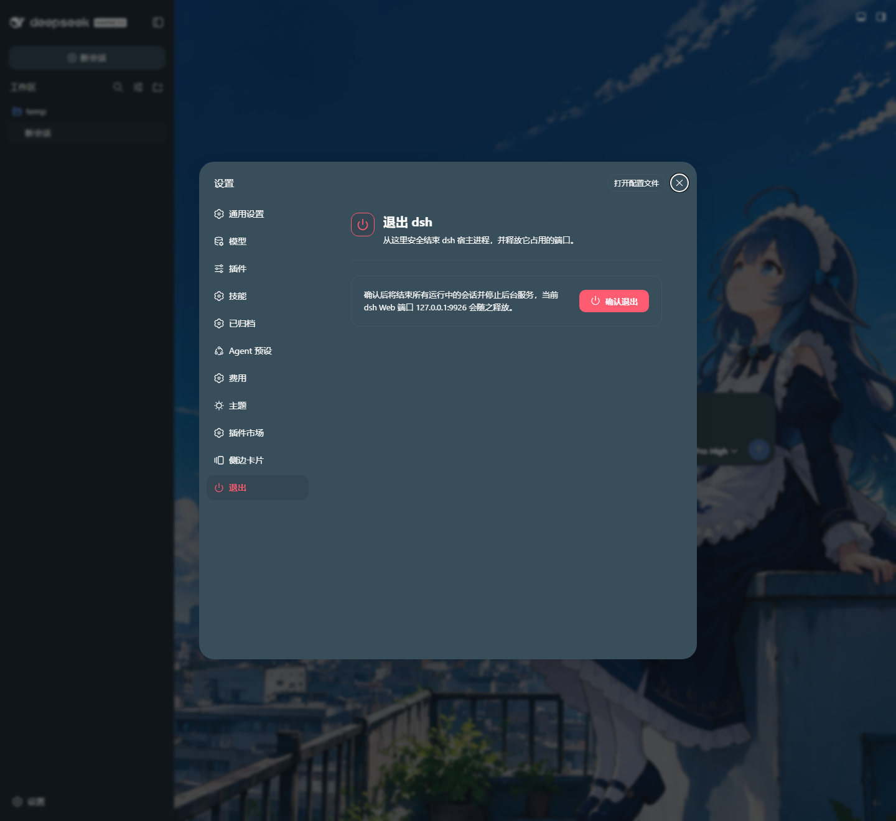

<div align="center">

# dsh-exit

**A focused exit control for the DeepSeek Harness web interface.**

[](https://npmjs.com/package/@deepseek-ai/dsh)
[](https://github.com/KeS1Ke/dsh-exit)
[](package.json)
[](package.json)

[简体中文](README.zh-CN.md)

</div>

> [!IMPORTANT]
> Confirming the action terminates the dsh host process and releases its ports. The host terminal window and the current browser tab are intentionally left open.

## ✨ What it does

`dsh-exit` adds a compact, floating **Exit** button to the lower-right corner of the entire dsh web interface.

- Opens a confirmation modal before doing anything destructive.
- Calls the typed `dshExit/exit` Remote method only after confirmation.
- Gives the gateway a short acknowledgement window, then ends the host process.
- Releases every port held by that process, including the usual `127.0.0.1:3080`.
- Keeps the terminal window and browser tab available for the next action.
- Uses the existing dsh design tokens and the Lucide `power` icon.

## 🎬 Animated exit flow

<p align="center">
  <video src="https://github.com/user-attachments/assets/ce8738b2-bc31-4c67-be6d-8098f29c7690" controls autoplay muted loop playsinline width="720"></video>
</p>

## 📸 Real dsh UI

The capture below comes from a running dsh Web profile with `dsh-exit` installed. The red power button is the actual plugin control rendered at the lower-right corner.

<p align="center">
  
</p>

## 🧱 What ships

| Layer | File | Responsibility |
| --- | --- | --- |
| Host | [`lib/index.js`](lib/index.js) | Registers the `dshExit` Cordis service and the typed `exit()` Remote method. |
| Client | [`lib/client.js`](lib/client.js) | Self-contained browser bundle: button, CSS, modal, keyboard handling, and Remote mounting. |
| Bundle patch | [`cordis.patch.yml`](cordis.patch.yml) | Inserts the plugin row into the dsh profile. |
| Package metadata | [`package.json`](package.json) | Declares the host entry, web client, and bundle patch. |
| Animated flow | GitHub video attachment | Archify trace animation rendered as a native video. |
| Real UI capture | [`docs/dsh-exit-real.png`](docs/dsh-exit-real.png) | Running dsh Web profile with the actual button visible. |


## 🚀 Install locally

The plugin is currently local and unpublished. Add it to a dsh web profile:

```sh
dsh plugin --profile web add "D:\Vibe-coding Projects\dsh\dsh-exit"
```

Restart the profile after installation. The dsh host loader resolves the bare runtime imports, so this package intentionally declares no runtime dependencies.

## 🖥️ UI behavior

| Interaction | Result |
| --- | --- |
| Click the floating power button | Opens the confirmation modal. |
| Click **Cancel**, press **Esc**, or click outside | Closes the modal without changing the host. |
| Click **Confirm exit** | Disables duplicate actions and invokes the host Remote method. |
| Remote call fails | Restores the controls and shows an inline error message. |
| Remote call succeeds | Closes the modal; the host exits shortly afterward. |

## 🔌 Remote contract

The host advertises a strict, parameterless Remote method:

```text
namespace: dshExit
method:    exit
result:    true
gateway:   /api/dshExit/exit
```

The client-side dsh gateway returns the standard envelope `{ ok: true, value: true }` on success. The service guards repeated calls with an `exiting` flag and schedules `process.exit(0)` after the response has a chance to settle.

## 🧪 Development checks

Run the lightweight syntax checks from the project root:

```sh
node --check lib/index.js
node --check lib/client.js
```

## 🗺️ Quick reference

- **Target:** DeepSeek Harness web profile
- **Install mode:** local plugin
- **Surface:** lower-right floating control
- **Action:** terminate the dsh host process
- **Default port mentioned by dsh:** `127.0.0.1:3080`
- **Repository topics:** `dsh` · `deepseek-harness` · `plugin` · `javascript` · `web`

The power icon comes from [Lucide](https://lucide.dev/icons/power) and is used under its ISC license.

<div align="center">

<sub>Small surface, explicit confirmation, predictable exit behavior.</sub>

</div>


